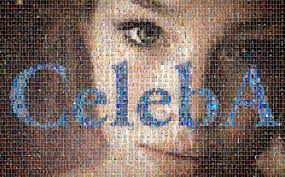
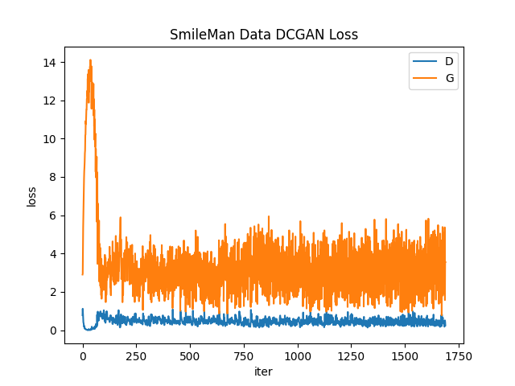
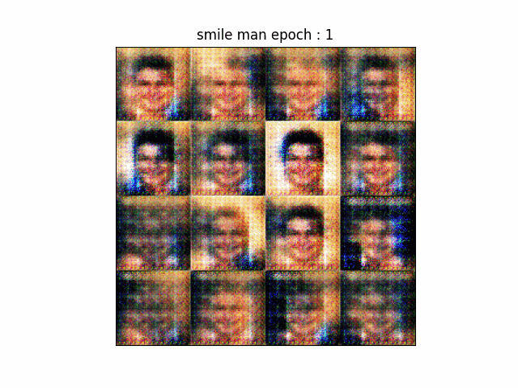
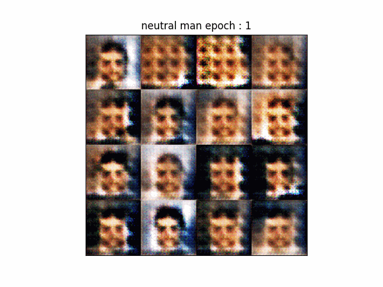
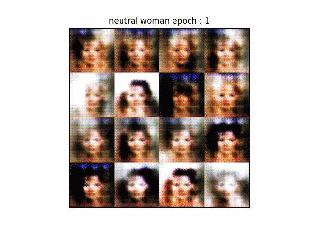

# DCGAN
 

### Datasets
-------------------
<a href='https://mmlab.ie.cuhk.edu.hk/projects/CelebA.html'>CelebA</a> : 약 20k개의 연예인 얼굴 datasets

  

### Model
-------------------
DCGAN

<a href='https://drive.google.com/drive/folders/1LtAKipP0b6bzJz09njBBAYZRVnkU211y?usp=drive_link'>Weights</a>

  

### Train
-------------------
epochs : 10, learning rate : 0.0005, optimizer : Adam(Beta1, 2 = 0.5), Loss : MiniMax Loss  
1. Smile Man
2. Neutral Man
3. Neutral Woman

 

### Result
-------------------
#### 1. D, G Loss

  

#### 2. Inference(Epoch = 1, 5, 10)
1. Smile Man

  

2. Neutral Man

  

3. Neutral Woman

  

#### 3. Vector Arithmetic
* Smile Man - Neutral Man + Neutral Woman = Smile Woman

  

#### 4. Walking in the latent Space
* Image A <-> Image B (interpolation)

  

